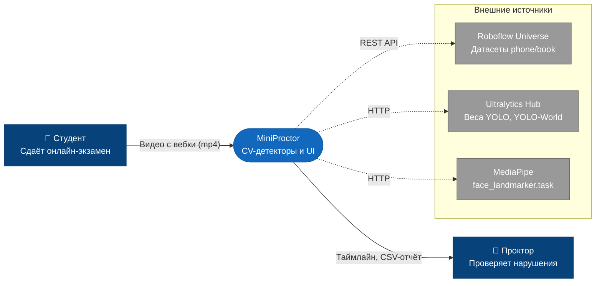
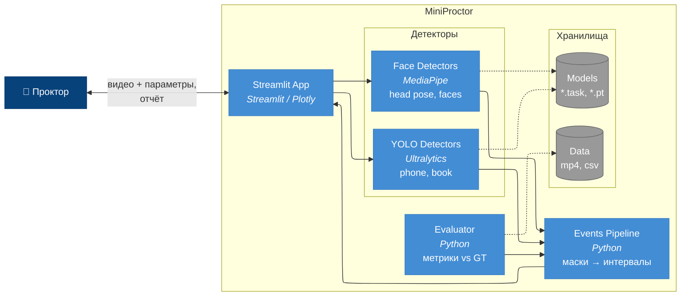
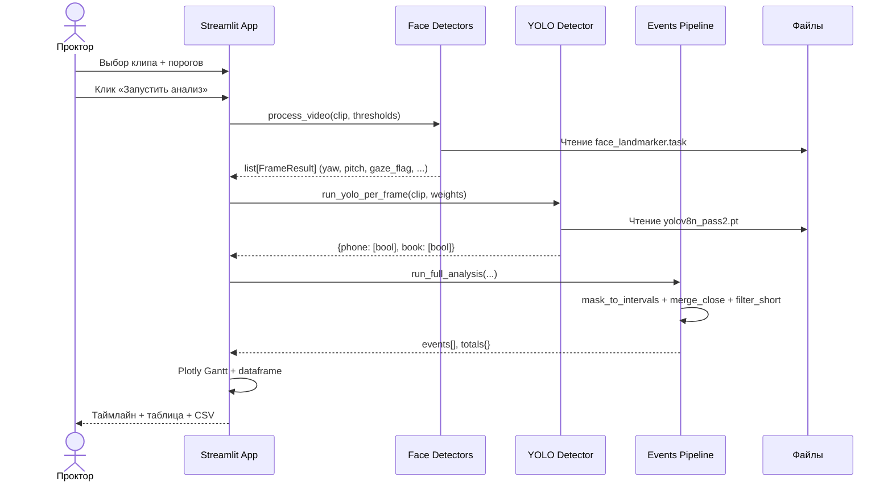
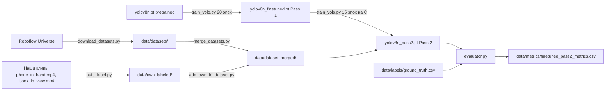

# Архитектура MiniProctor

Документ описывает структуру проекта по модели C4 -- от верхнеуровневого системного контекста до отдельных модулей. Источники диаграмм -- Mermaid в этом файле и в `docs/diagrams/src/*.mmd`, статичные PNG-рендеры -- в `docs/diagrams/images/`.

## C4 Context: системный контекст

Кто пользуется системой и что она получает на входе и выдаёт на выходе. PNG: [diagrams/images/context.png](diagrams/images/context.png).

Это уровень разговора с продактом или нанимающим менеджером: «есть студент, есть проктор, система между ними». ML-подробности скрыты.

## C4 Container: контейнеры внутри системы

Что внутри MiniProctor и как куски разговаривают друг с другом. PNG: [diagrams/images/container.png](diagrams/images/container.png).

Уровень разговора с разработчиком, который зашёл в проект: «вот блоки, вот связи».

## Модули проекта

Карта файлов в `src/`. Каждый модуль -- атомарная роль.

| **Модуль** | **Роль** | **Зависимости** |
|:---|:---|:---|
| `detectors.py` | Face Landmarker, head pose, multi-face, no-face. Конфигурируемые пороги | `mediapipe`, `opencv-python`, `numpy`, `scipy` |
| `yolo_detector.py` | Покадровый прогон YOLO по нужным классам, маппинг синонимов имён | `ultralytics` |
| `events.py` | Конвертация масок в интервалы, сглаживание, агрегаты | внутренние |
| `evaluator.py` | Сравнение детекций с ground truth, расчёт метрик | внутренние |
| `app.py` | Streamlit UI: видео, таймлайн, таблица, экспорт | `streamlit`, `plotly`, `pandas` |
| `record_webcam.py` | Запись клипов с вебки для тестов | `opencv-python` |
| `label_clip.py` | Интерактивная разметка интервалов в CSV | `opencv-python` |
| `auto_label.py` | Авторазметка bbox через YOLO-World для своих кадров | `ultralytics`, `clip` |
| `download_datasets.py` | Скачивание Roboflow-датасетов по списку workspace/project | `roboflow` |
| `merge_datasets.py` | Объединение двух Roboflow-датасетов в единую схему phone+book | -- |
| `add_own_to_dataset.py` | Добавление авторазмеченных кадров в смешанный датасет | -- |
| `train_yolo.py` | Запуск fine-tune от любых стартовых весов | `ultralytics` |
| `tune_thresholds.py` | Sweep по yaw/pitch порогам с расчётом F1 | внутренние |
| `make_synthetic_multiface.py` | Синтетическая вставка второго лица в clean_baseline | `opencv-python` |
| `smoke_mediapipe.py`, `smoke_yolo.py` | Smoke-тесты Дня 1, оставлены для истории | -- |

## Поток данных: от видео до отчёта

Что происходит, когда проктор нажимает «Запустить анализ» в UI. PNG: [diagrams/images/inference-flow.png](diagrams/images/inference-flow.png).

## Поток обучения: как получены веса Pass 2

Отдельный поток, который проходит один раз. После -- веса лежат в `models/` и используются в инференсе. PNG: [diagrams/images/training-flow.png](diagrams/images/training-flow.png).

## Ключевые архитектурные решения

### Разделение face- и object-детекторов

Face Landmarker и YOLO работают независимо, на разных стеках (MediaPipe + OpenCV vs Ultralytics + PyTorch). Это упрощает отладку: проблемы в одном детекторе не задевают другой, и метрики считаются по каждому отдельно.

### Сглаживание как слой презентации, а не часть детектора

Детекторы возвращают «честные» покадровые маски. Конвертация в эпизоды и сглаживание -- отдельный шаг в `events.py`, его параметры можно крутить в UI без переобучения. Это разделение concerns: модель меряет, постпроцессинг представляет.

### Ground truth как single source of truth

`data/labels/ground_truth.csv` -- единственный файл с разметкой, единая схема `clip, start_sec, end_sec, event_type`. Все метрики и оценки опираются на него. Если меняется разметка -- меняется один файл, всё пересчитывается.

### Hybrid dataset: открытые источники + свои кадры

Roboflow-датасеты дают объём, авторазмеченные кадры -- доменную адаптацию. История проверена экспериментом в Дне 4: только Roboflow дал регрессию, добавление 89 своих кадров пробило baseline. Это решение оправдано измерением, а не интуицией.

### YOLO-World как ускоритель разметки

Open-vocabulary детектор используется не в инференсе, а только в подготовке данных. Это исключает зависимость production-кода от тяжёлой модели и позволяет масштабировать разметку при добавлении новых классов нарушений.

## Что вынесено за скобки

- **Real-time stream**. Сейчас анализ -- batch-режим, файл целиком. Для онлайн-прокторинга нужен другой pipeline с буферизацией кадров и инкрементальной обработкой.
- **Хранение записей**. Видео экзаменов хранятся локально в `data/raw/`, без шифрования и retention-политик. Для продакшна потребуется storage с соответствующими гарантиями.
- **Аутентификация и авторизация**. UI открыт для любого, кто видит порт 8501. Для команды прокторинга нужна интеграция с их LMS / SSO.
- **Audit log**. Действия проктора не логируются. Для апелляционных процедур потребуется запись «кто, когда, что увидел, какое решение принял».

Эти ограничения зафиксированы в `docs/brief.md` как нефункциональные требования out-of-scope для пет-проекта.
